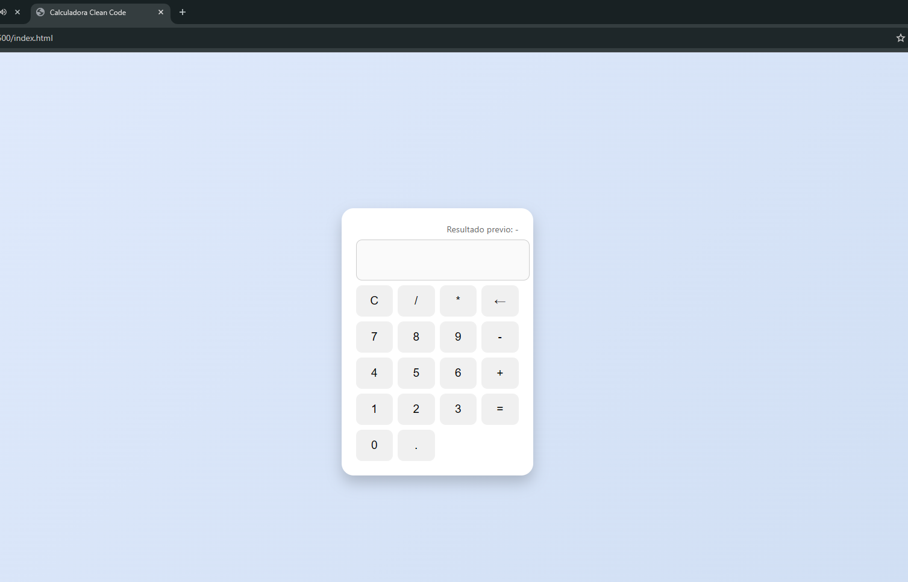

# Calculadora Clean Code_DylanGranizo

Esta es una calculadora web mejorada construida con HTML, CSS y JavaScript, aplicando principios del repositorio [Clean Code JavaScript](https://github.com/andersontr15/clean-code-javascript-es).

---

## 🎯 Características

- Cálculos básicos (suma, resta, multiplicación, división)
- Accesibilidad con teclado y lectores de pantalla
- Historial del último resultado
- Diseño limpio y responsivo

---

## 📌 Principios de Clean Code Aplicados

| Principio                                       | Descripción                                                                        | Archivo       |
|------------------------------------------------|------------------------------------------------------------------------------------|---------------|
| Nombres significativos                         | Funciones como `appendNumber`, `updateDisplay`, `calculateResult`                 | script.js     |
| Funciones pequeñas                             | Cada función hace una sola tarea, clara y específica                              | script.js     |
| Evitar duplicación                             | Uso de funciones reutilizables (`isOperator`, `lastChar`, etc.)                   | script.js     |
| Código autoexplicativo                         | Pocas líneas de comentarios gracias a nombres intuitivos                          | script.js     |
| Separación de responsabilidades                | HTML (estructura), CSS (estilo), JS (lógica)                                      | Todos         |
| Manejo de errores                              | `try/catch` para detectar errores en evaluaciones matemáticas                     | script.js     |
| Accesibilidad y semántica                      | Uso de `aria-label` y soporte de teclado                                          | index.html    |
| Principio de extensión, no modificación        | Teclado y diseño fueron añadidos sin reescribir lógica base                       | script.js     |

---
## Vista de la calculadora

## ▶ Cómo usar
1. Guarda los archivos `index.html`, `style.css`, y `script.js` en la misma carpeta.
2. Abre `index.html` en tu navegador.

